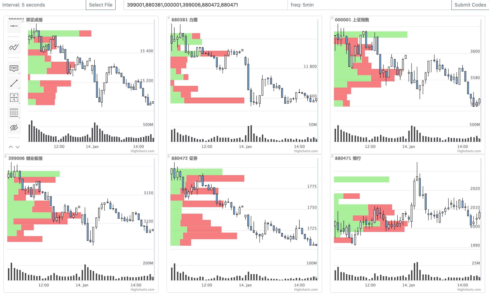
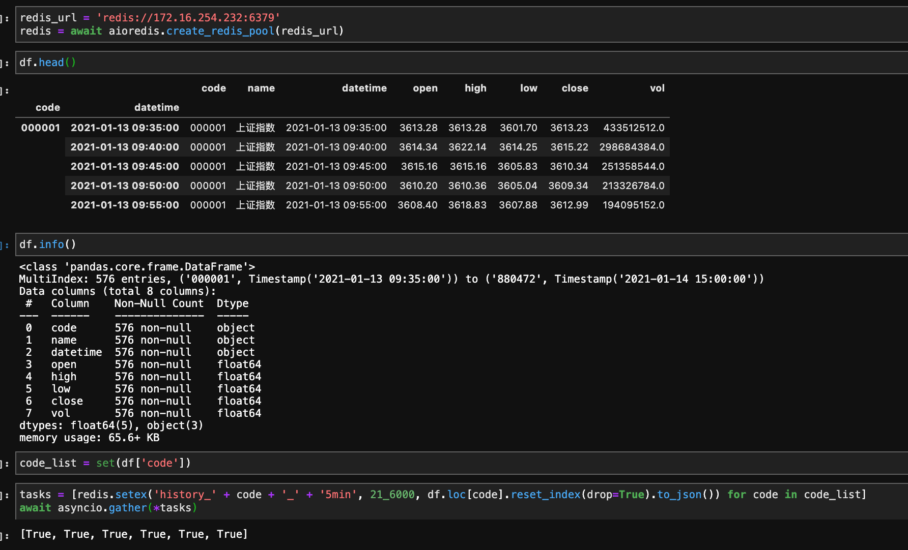

# BarReplay
 A Stock Bar Replayer

A multi bar replay app build with nodejs, support csv file and redis backend.

Dependencies: socket.io, socketio-file-upload, noderedis.

Screen Capture


Send dataframe to redis(with [aioredis](https://github.com/aio-libs/aioredis))
```
tasks = [redis.setex('history_' + code + '_' + '5min', 21_6000, df.loc[code].reset_index(drop=True).to_json()) for code in code_list]
await asyncio.gather(*tasks)
```


startup with docker
```
docker-compose up -d
```
check logs
```
docker logs container-id
```
remove docker container
```
docker-compose down
```

startup with local nodejs env:
```npm install``` then ```node app.js```
